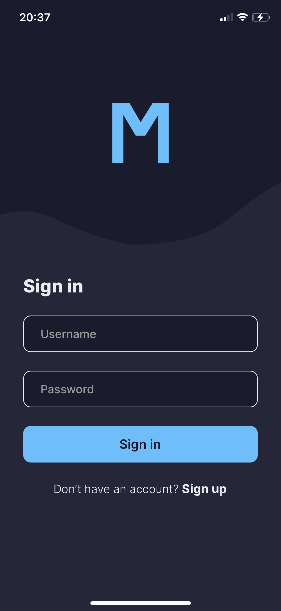
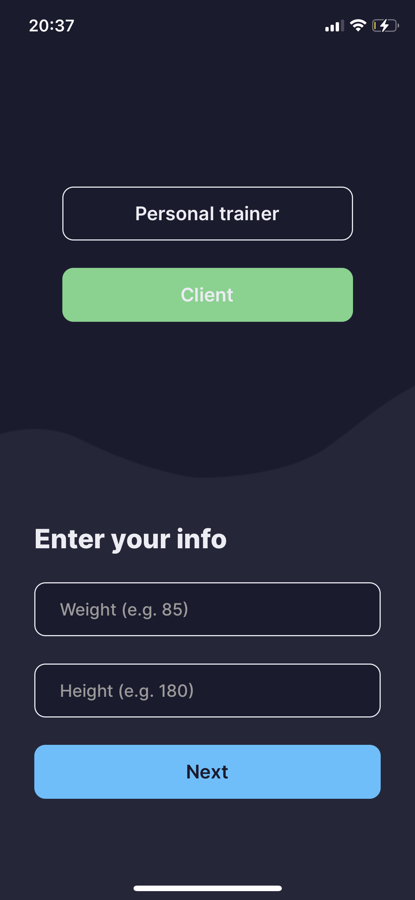
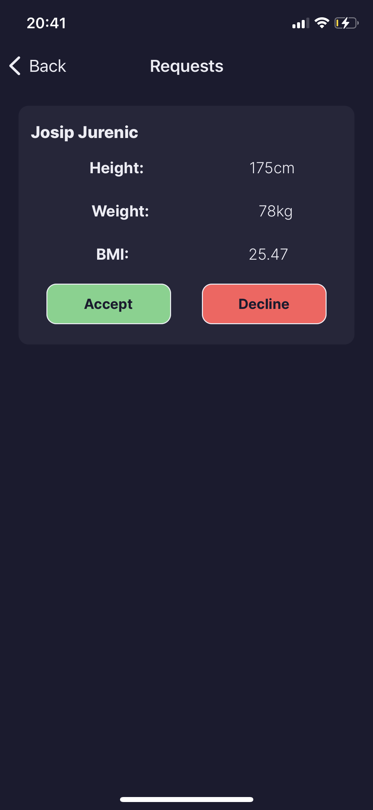
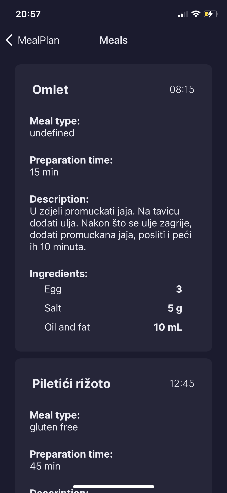
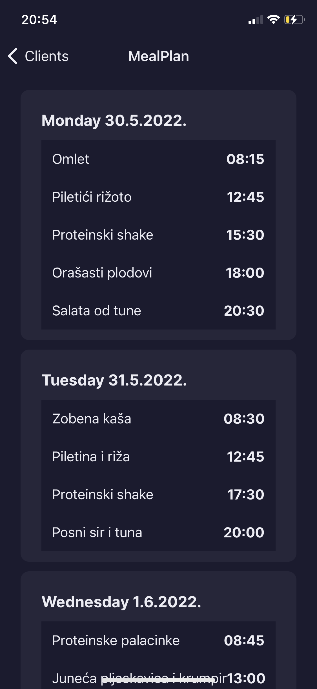

# Macro Mate

### Description
This project was developed as part of an undergraduate thesis. The goal of the project is to create an application that 
connects trainers with clients, provides dietary advice to users, and manages nutritional plans. The application enables 
trainers and nutritionists to effectively communicate with users, track their progress, and tailor dietary plans to 
individual user needs.

### App Screenshots

  
  
  

  
  

### Code
There are two main components to this project: the backend and the frontend. The backend, developed using Spring Boot, 
is responsible for handling and storing all data, as well as interacting with the database. The frontend, developed as a 
mobile app using React Native, is responsible for connecting trainers with clients, providing dietary advice, and 
managing nutritional plans.

More information about the project can be found in the README files for the backend and app components.
